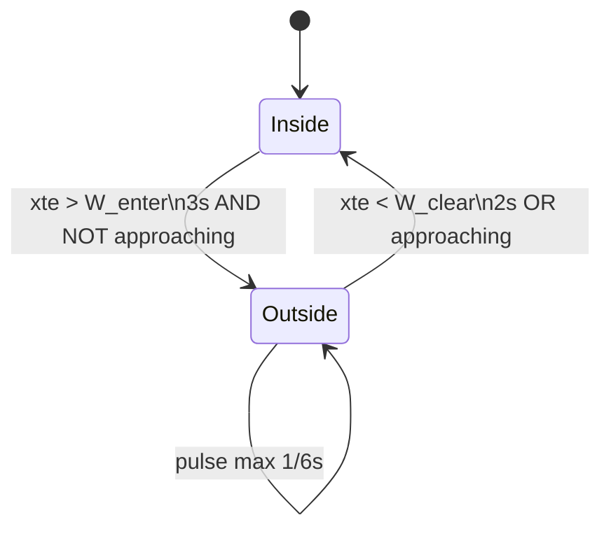
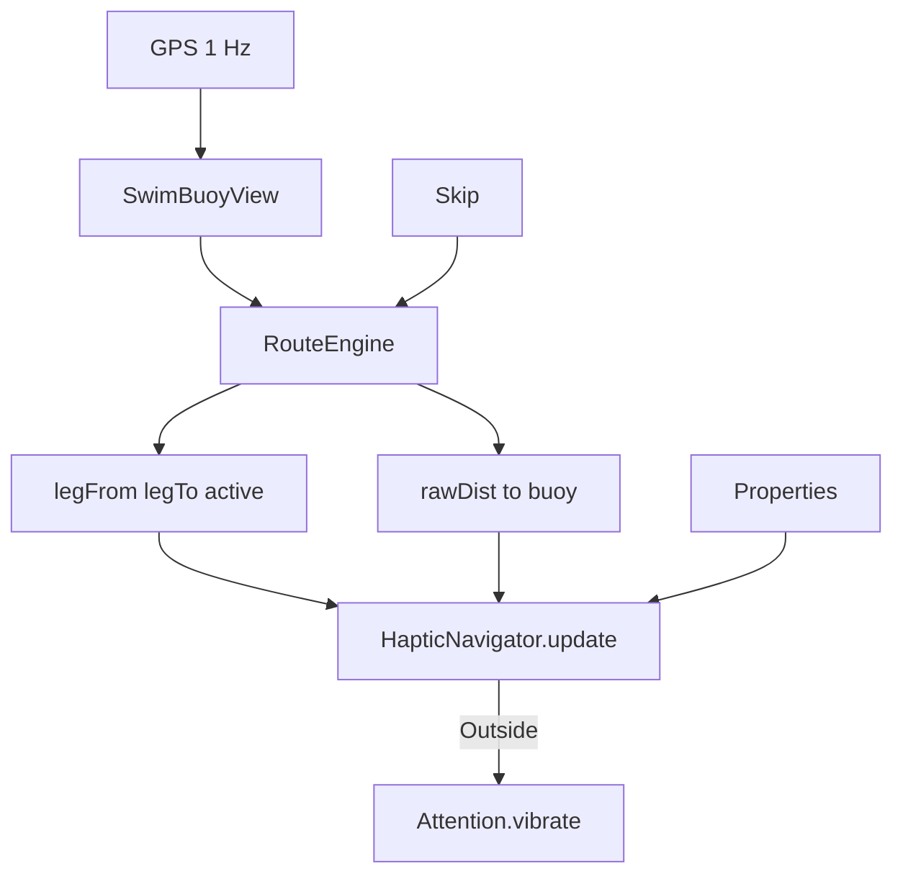

# Спецификация: вибро-навигация (коридор плеча)

Версия: **0.4**  
Дата: 2026-06-17  
Статус: к реализации  
Устройство: Garmin FR955, Connect IQ watch-app SwimBuoy / SB_*

**Заменяет** v0.3 (тренд дистанции до буя + `legMin`). Трендовый режим в коде — удалить при реализации.

Связанные файлы:

- [`connect-iq/source/HapticNavigator.mc`](../connect-iq/source/HapticNavigator.mc) — XTE, состояние, импульс
- [`connect-iq/source/GeoUtils.mc`](../connect-iq/source/GeoUtils.mc) — haversine, **cross-track** (добавить)
- [`connect-iq/source/RouteEngine.mc`](../connect-iq/source/RouteEngine.mc) — буи, плечо, skip, session start
- [`connect-iq/source/SwimBuoyView.mc`](../connect-iq/source/SwimBuoyView.mc) — GPS, вызов haptic
- [`scripts/analyze_corridor_shuchye.py`](../scripts/analyze_corridor_shuchye.py) — калибровка, GPX для карты
- [`routes/Щучье20260614/shuchye_corridor_map.gpx`](../routes/Щучье20260614/shuchye_corridor_map.gpx) — визуализация ±20 m
- [`docs/spec-watch-ui.md`](spec-watch-ui.md) — экран: метры + полоса коридора, стрелка у буя
- [`docs/decisions.md`](decisions.md) — продуктовые решения MVP

---

## Шпаргалка: коридор (на одном экране)

**Смысл:** тишина = в целом идёшь к **активному буу**. **Короткий вибро** = устойчиво **не туда** (вне узкого GPS-коридора **и** не приближаешься к буу).

**Ось плеча:** прямая от **начала плеча** до **активного буя** (хорда, не дуга трека).

| | |
|--|--|
| **Ширина коридора** | ±**20 m** от хорды (`hapticCorridorHalfWidthM`) — **бюджет GPS**, не «допустимая дуга» |
| **Вход в тревогу** | \|XTE\| > **20 m** подряд **3 с** **и** нет приближения к буу |
| **Выход в тишину** | \|XTE\| < **15 m** подряд **2 с** **или** снова приближаешься к буу |
| **Приближение** | За **15 с** дистанция до буя уменьшилась ≥ **3 m** (сглаженная) |
| **Молчим всегда** | в **20 m** от буя (dwell), первые **3 с** после смены буя, чаще **1 вибро / 6 с** |

**Skip буя** (меню) — пропустить невидимый / не тот буй.

*Подробности — ниже.*

---

## 1. Цель

Тактильная обратная связь **без взгляда на часы**:

- **тишина** по умолчанию — пловец в целом идёт к активному буу;
- **короткий импульс** — устойчиво сбился с направления (не GPS-выброс на дуге);
- **skip буя** — полевой кейс (P2 не виден, идут на P3);
- плечо **старт → P1** строится от **фактического GPS на Start**, не от planned `route.start`.

Не в scope:

- отдельные паттерны «буй взят»;
- метроном «на курсе»;
- навигация по компасу / heading;
- широкий коридор «вместить любую дугу» (см. калибровку Щучье).

---

## 2. Принцип: коридор = фильтр GPS, не штраф за дугу

Пловец **может** плыть дугой в 50–60 m от хорды P1→P2 — это неоптимально, но **не должно** раздувать коридор и **не должно** вибрировать, если **метры до буя убывают**.

Узкий коридор (**±15–20 m**) отражает **погрешность GPS на воде**, а не 95-й перцентиль фактического трека.

Данные Щучье (Коля+Рома, FR955, 1 Гц):

| Метрика | Значение |
|---------|----------|
| \|ΔXTE\| за 1 с, med | **~0.1 m** |
| \|ΔXTE\| за 1 с, p99 | **~0.4 m** |
| редкий выброс \|ΔXTE\| | до **~12 m** |

Абсолютное \|XTE\| на дуге P1→P2 med **~55 m** — это **геометрия плавания**, не шум.

**Следствие:** тревога = **(вне коридора устойчиво) AND (не приближаюсь к буу)**. Одного XTE недостаточно.

---

## 3. Геометрия плеча

### 3.1. Отрезок плеча

Для активного буя `B` конец отрезка — координаты `B`.

Начало отрезка:

| Ситуация | Начало плеча |
|----------|----------------|
| Первый буй в `session.order`, ещё не взят | **Фактический GPS** в момент первого `captureSessionStart` (`sessionStartLat/Lon`) |
| Любой следующий буй | Координаты **предыдущего буя в `order`** (точка `order[activeIndex - 1]`), не «последняя GPS-позиция» |

Используем **конечный отрезок** `[legFrom] → [activeBuoy]`, не луч в бесконечность.

### 3.2. Cross-track error (XTE)

```text
xteM = crossTrackDistanceM(lat, lon, legFromLat, legFromLon, legToLat, legToLon)
```

- Возвращает **подписанное** поперечное расстояние в метрах; для порогов — `abs(xteM)`.
- Проекция **на отрезок**: `along < 0` или `along > legLen` — clamp к ближайшей вершине (стандартная point-to-segment).

Реализация: `GeoUtils.crossTrackDistanceM(...)` → `[xteM, alongM, legLenM]`.

### 3.3. Зона отключения у вершин

Пока `alongM < endpointBufferM` **или** `alongM > legLenM - endpointBufferM` — **не обновлять** счётчики коридора (default `endpointBufferM = 50`).  
Дополнительно: внутри `arrivalRadiusM` — вибро выключено полностью (§6).

### 3.4. Первое плечо и `route.start`

- В JSON: поле `start` (planned) — для UI/аналитики, **не** для оси плеча.
- Ось: `sessionStart` (GPS) → P1.
- `startMismatchM` / `isStartAnchorActive` — **убрать из haptic** (v0.3); плечо уже учитывает фактический старт.

---

## 4. Сглаживание

Перед порогами:

```text
smoothedXteM = (1 − α) × smoothedXteM + α × abs(rawXteM)
smoothedDistM = (1 − α) × smoothedDistM + α × rawDistM
```

- Default `hapticEmaAlpha` = **0.3**
- Сброс обоих EMA при смене / skip активного буя

---

## 5. Приближение к буу (`approaching`)

Чтобы дуга вне ±20 m не давала вибро:

```text
approaching = (smoothedDist(now) − smoothedDist(now − W)) ≤ −approachProgressM
```

- `W` = `hapticApproachWindowSec` (default **15**)
- `approachProgressM` = **3** m (default)

Пока `approaching == true` — **не входить** в `Outside` и **выйти** из `Outside`, если уже там.

История `smoothedDist` — как в v0.3 (`distHistory`), окно **W** с.

---

## 6. Состояния и гистерезис

### 6.1. Пороги (пространственный гистерезис)

```text
W_enter = hapticCorridorHalfWidthM          // default 20
W_clear = W_enter − hapticCorridorHysteresisM   // default 15 (hysteresis 5)
```

| Переход | Условие (по `smoothedXteM`) |
|---------|------------------------------|
| Inside → Outside | `smoothedXteM > W_enter` |
| Outside → Inside | `smoothedXteM < W_clear` |
| В полосе W_clear … W_enter | **сохранять** текущее состояние |

### 6.2. Устойчивость (временной гистерезис)

На каждом GPS-тике (1 Гц), только в «рабочей» зоне along (§3.3):

```text
если smoothedXteM > W_enter:
    outsideSec += 1; insideSec = 0
иначе если smoothedXteM < W_clear:
    insideSec += 1; outsideSec = 0
иначе:
    outsideSec = 0; insideSec = 0   // мёртвая зона — сброс счётчиков
```

| Событие | Условие |
|---------|---------|
| **Вход в `Outside`** | `outsideSec ≥ hapticCorridorEnterSec` (**3**) **и** `!approaching` |
| **Выход в `Inside`** | `insideSec ≥ hapticCorridorClearSec` (**2**) **или** `approaching` |

### 6.3. Вибро-импульс

- Состояние `Outside` + интервал ≥ `hapticPulseMinIntervalSec` (**6**) → один импульс за тик.
- `Attention.vibrate()` — профиль как сейчас (50 ms, 200 ms).

### 6.4. Диаграмма



---

## 7. Когда вибро выключено полностью

- `hapticMode` = `off`
- нет GPS / нет маршрута / сессия не активна
- `insideRadius` активного буя (`arrivalRadiusM`, default 20 m)
- первые `hapticCorridorEnterSec` секунд после смены буя (накопление EMA / истории)
- `along` в буфере у вершин отрезка (§3.3) — не менять состояние, не пульсировать

---

## 8. Skip буя

Без изменений по смыслу v0.3:

1. `skipActiveBuoy()` — текущий ID в `taken`, `activeIndex++`, сброс dwell.
2. Сброс `HapticNavigator` (EMA, счётчики, `Inside`).
3. Меню → Confirmation «Пропустить буй».

Полевой кейс: P2 не виден → skip → плечо от P1 к P3 (координаты P1 → P3).

---

## 9. Конфигурация (`properties.xml`)

| Property ID | Тип | Default | Описание |
|-------------|-----|---------|----------|
| `hapticMode` | string | `corridor_off_course` | `off` \| `corridor_off_course` |
| **`hapticCorridorHalfWidthM`** | float | **20** | Порог входа \|XTE\| (GPS-бюджет) |
| **`hapticCorridorHysteresisM`** | float | **5** | `W_clear = halfWidth − hysteresis` |
| **`hapticCorridorEnterSec`** | number | **3** | Секунд подряд за W_enter для тревоги |
| **`hapticCorridorClearSec`** | number | **2** | Секунд подряд за W_clear для тишины |
| `hapticApproachWindowSec` | number | **15** | Окно проверки приближения к буу |
| `hapticApproachProgressM` | float | **3** | Мин. сокращение dist за окно |
| `hapticEmaAlpha` | float | **0.3** | EMA для XTE и dist |
| `hapticPulseMinIntervalSec` | number | **6** | Мин. интервал импульсов в `Outside` |
| `hapticLegEndpointBufferM` | float | **50** | Не оценивать XTE у вершин отрезка |

**Удалить** при реализации (legacy v0.3):  
`hapticTrendWindowSec`, `hapticOnProgressScale`, `hapticOffProgressScale`, `hapticOffClearScale`, `hapticLegDriftBudgetM`, `hapticStartProgressM`, `hapticStartDriftM`.  
`hapticStartMismatchM` — оставить только если нужен для UI/логов; **не** для haptic.

---

## 10. Архитектура кода

### 10.1. Модули

```text
GeoUtils.mc              — ADD crossTrackDistanceM, point-to-segment
RouteEngine.mc           — ADD getLegFromLatLon(), getLegToLatLon() / getActiveLegEndpoints()
HapticNavigator.mc       — REWRITE: XTE, approaching, Inside/Outside, pulse
SwimBuoyView.mc          — передавать lat/lon + leg endpoints + dist; убрать startAnchor в haptic
properties.xml           — новые ключи (§9)
```

### 10.2. Поток данных



### 10.3. `HapticNavigator` (интерфейс)

```monkeyc
class HapticNavigator {
    function loadSettings() as Void;
    function resetForNewBuoy(rawDistM as Float, rawXteM as Float, nowSec as Number) as Void;

    function update(
        nowSec as Number,
        rawDistM as Float,
        rawXteM as Float,       // abs cross-track; null / ignore if outside along buffer
        alongValid as Boolean,  // false in endpoint buffer
        insideRadius as Boolean,
        sessionActive as Boolean
    ) as Void;

    function shouldPulse() as Boolean;
    function clearPulse() as Void;
}
```

### 10.4. `RouteEngine`

```monkeyc
// Возвращает false, если плечо не определено (нет session start на первом буе)
function getActiveLegEndpoints() as Array?;  // [fromLat, fromLon, toLat, toLon]
```

Логика `from`: §3.1.

---

## 11. Калибровка и GPX (Щучье)

Скрипт: `python scripts/analyze_corridor_shuchye.py`

- Константа `GPS_CORRIDOR_HALF_WIDTH_M = 20` — для экспорта на карту.
- **`shuchye_corridor_map.gpx`** — хорды ±20 m + треки 4 пловцов.
- Отчёт: `routes/Щучье20260614/corridor_analysis_report.txt`.

На P1→P2 треки **визуально вне** узкого коридора — ожидаемо; в приложении тишина при `approaching`.

---

## 12. Тестирование

### 12.1. Симулятор

- GPX Щучье / Левашово, Activity Data → Play.
- P2→P3: тишина при подходе по дуге или по хорде.
- Уход на P3 при активном P2: вибро после 3 с, если dist до P2 не падает.
- Skip P2 → ось P1→P3, сброс состояния.
- Краткий GPS-выброс: без вибро (< 3 с вне коридора).

### 12.2. Критерии приёмки

- [ ] Default ±20 m, гистерезис 5 m, enter 3 s / clear 2 s
- [ ] Дуга 50 m от хорды P1→P2 + приближение к P2 → **тишина**
- [ ] Skip P2 / плывут на P3 при активном P2 → **вибро** (если не approaching к P2)
- [ ] Импульс не чаще 1 / 6 s в `Outside`
- [ ] Skip сбрасывает EMA и состояние
- [ ] Первое плечо: ось session GPS → P1

### 12.3. Регрессия

Расширить `scripts/analyze_corridor_shuchye.py` или добавить `scripts/simulate_corridor_haptic.py` — прогон GPX с логикой §5–6.

---

## 13. Этапы реализации

| Этап | Содержание |
|------|------------|
| **1** | `GeoUtils.crossTrackDistanceM`, `RouteEngine.getActiveLegEndpoints` |
| **2** | `properties.xml`, rewrite `HapticNavigator`, интеграция в `SwimBuoyView` |
| **3** | Удалить legacy trend / startAnchor из haptic; обновить manifest при необходимости |
| **4** | Прогон GPX Щучье; подкрутка default только при полевых данных |

---

## 14. Известные ограничения

- **P1→P2, skip P2:** med \|XTE\| к хорде P1→P2 у «правильных» и у skip-пловцов **близки** (~50–60 m). Коридор **не заменяет** skip.
- **Ось = хорда**, не фактическая дуга озера; альтернатива (центральная линия по GPX) — не MVP.
- COROS / другие часы — отдельная калибровка ширины при расширении устройств.

---

## 15. Резюме для разработчика

1. **Вибро = устойчиво вне узкого коридора И не приближаешься к буу.**
2. **±20 m** — GPS-бюджет, не envelope трека.
3. **Гистерезис:** вход 20 m / выход 15 m + **3 s / 2 s** sustain.
4. **Приближение** (−3 m / 15 s) — «иду верно» на дуге.
5. **Skip буя** обязателен.
6. **Плечо** = session GPS → P1, далее prev buoy → active buoy.
