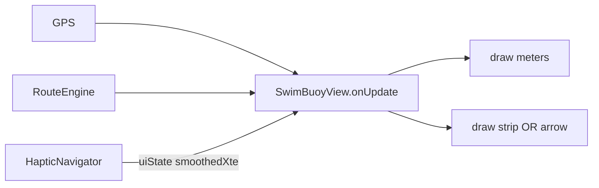

# Спецификация: экран часов (метры + коридор)

Версия: **0.1**  
Дата: 2026-06-17  
Статус: к реализации  
Устройство: Garmin FR955, Connect IQ watch-app SwimBuoy / SB_*

**Заменяет** UX из [`decisions.md`](decisions.md) §2 («метры + стрелка всегда»).

Связанные документы:

- [`docs/spec-haptic-navigation.md`](spec-haptic-navigation.md) — коридор, XTE, вибро (общая геометрия плеча)
- [`connect-iq/source/SwimBuoyView.mc`](../connect-iq/source/SwimBuoyView.mc) — отрисовка
- [`connect-iq/source/GeoUtils.mc`](../connect-iq/source/GeoUtils.mc) — cross-track (добавить)
- [`connect-iq/source/RouteEngine.mc`](../connect-iq/source/RouteEngine.mc) — активный буй, дистанция, dwell
- [`docs/decisions.md`](decisions.md) — продуктовые решения

---

## Шпаргалка

| Зона | Что на экране |
|------|----------------|
| **Далеко от буя** (> 50 m) | Крупные **метры** + **полоса коридора** (точка = ты) |
| **Вблизи буя** (≤ 50 m) | Метры + **стрелка на буй** (полосу скрыть) |
| **В радиусе** (≤ 20 m) | Метры + **dwell** `n/4s` |
| **Вибро** | Без смены экрана; цвет полосы согласован с `Outside` / `approaching` |

**Стрелки на дистанции нет** — без компаса она привязана к северу и «прыгает» при повороте запястья.

---

## 1. Цель

Главный экран заплыва должен отвечать на два вопроса **одним взглядом**:

1. **Сколько метров** до активного буя?
2. **Где я относительно линии** к этому буу (влево / вправо / в коридоре)?

Не в scope этого экрана:

- карта озера, трек, все буи;
- мини-GPX как на MapMagic;
- отдельные data field’ы Garmin.

Вибро-логика — в [`spec-haptic-navigation.md`](spec-haptic-navigation.md); UI **использует те же** XTE и пороги, но не дублирует их описание.

---

## 2. Почему убрали постоянную стрелку

Текущая стрелка: `bearing к буу − heading GPS`. На открытой воде **heading часто null или шумный** → остаётся азимут к цели относительно **севера**, не запястья. Пловец вращает руку — стрелка скачет, хотя курс не менялся.

**Полоса XTE** привязана к **оси плеча** (хорда `legFrom → activeBuoy`), не к ориентации часов — стабильнее на дистанции.

---

## 3. Макет экрана

Дисплей FR955: круг ~260×260 px. Один экран, без свайпов в MVP.

### 3.1. Режим «на плече» (`distance > arrowNearDistM`)

```text
┌─────────────────────────┐
│      Буй 2              │  FONT_TINY, имя активной точки
│                         │
│        387              │  FONT_NUMBER_HOT
│        м                │  FONT_SMALL
│                         │
│   │        │            │  границы коридора (±W)
│   │   ●    │            │  точка пловца (смещение по XTE)
│   │════════│            │  ось (опционально, тонкая)
│                         │
└─────────────────────────┘
```

- Полоса: горизонтальная, по центру экрана по вертикали (ниже метров).
- Ширина полосы на экране: **фиксированная** (например 140 px) = **2 × `hapticCorridorHalfWidthM`** (default ±20 m → 40 m total).
- Позиция точки: `dotX = centerX + clamp(xteSmoothed / halfWidthM, -1..1) * (stripPx/2)`.

### 3.2. Режим «у буя» (`distance ≤ arrowNearDistM`)

```text
┌─────────────────────────┐
│      Буй 2              │
│        38               │
│        м                │
│         ▲               │  стрелка на bearing к буу
│         │               │  (географический азимут)
│      2/4s               │  если в радиусе — dwell
└─────────────────────────┘
```

- **Полосу не рисуем** — у конца плеча XTE геометрически бессмысленен (§3.4 в haptic spec).
- Стрелка — как сейчас `drawArrow`, цвет зелёный в радиусе.

### 3.3. Состояния без полосы / метров

| Состояние | Экран |
|-----------|--------|
| Нет маршрута | «No route» |
| Finished | «All done» |
| Нет GPS | «Waiting GPS» + статус |
| Первые 3 с после смены буя | Метры + полоса **серая** / точка по центру (накопление EMA) |

---

## 4. Цвета и согласование с вибро

Использовать те же сигналы, что `HapticNavigator` (после rewrite):

| Сигнал | Полоса / точка | Стрелка (у буя) |
|--------|----------------|-----------------|
| `Inside` (в коридоре) | точка **белая**, границы серые | серая |
| `approaching` (дуга, но к буу) | точка **белая**, границы **зелёные** | — |
| `Outside` (тревога вибро) | точка **красная**, границы красные | — |
| В радиусе 20 m | полоса скрыта | **зелёная** |

`HapticNavigator` должен отдавать наружу (для View):

```monkeyc
function getCorridorUiState() as String;  // "warming" | "inside" | "approaching" | "outside"
function getSmoothedXteM() as Float?;
```

View **не дублирует** пороги — только рисует по состоянию и `smoothedXteM`.

---

## 5. Данные и геометрия

Общее с [`spec-haptic-navigation.md`](spec-haptic-navigation.md) §3:

- `legFrom` / `legTo` — из `RouteEngine.getActiveLegEndpoints()`
- `xteM`, `alongM` — `GeoUtils.crossTrackDistanceM`
- `smoothedXteM` — EMA, тот же α что для вибро
- Если `along` в endpoint buffer — полосу **не обновлять** (держать последнее значение или точку по центру)

---

## 6. Конфигурация

| Property | Тип | Default | Описание |
|----------|-----|---------|----------|
| `uiArrowNearDistM` | number | **50** | Ниже — стрелка вместо полосы |
| `uiStripWidthPx` | number | **140** | Ширина полосы на экране (px) |
| `hapticCorridorHalfWidthM` | float | **20** | Масштаб: XTE → позиция точки (из haptic spec) |

`uiStripWidthPx` можно захардкодить в MVP; property — если понадобится тюнинг под другие часы.

---

## 7. Поведение при дуге (P1→P2)

На Щучьем пловцы часто **вне** узкого ±20 m, но **приближаются** к буу. На экране:

- не показывать «аварийный» красный, пока `approaching == true`;
- точка сбоку + **зелёные** границы = «не идеальная линия, но к буу ок».

Это согласовано с вибро: **тишина** при approaching.

---

## 8. Архитектура



Изменения:

- `SwimBuoyView.onUpdate` — ветка по `distance` vs `uiArrowNearDistM`
- `drawCorridorStrip(dc, xte, uiState)` — новый метод
- `drawArrow` — только в режиме «у буя»; убрать с основного режима
- Удалить зависимость UI от `lastHeading` для дальнего режима

---

## 9. Тестирование

### Симулятор

- GPX Щучье: на P2→P3 точка близко к центру полосы.
- P1→P2: точка сбоку, границы зелёные при приближении к P2.
- Подход < 50 m: полоса исчезает, появляется стрелка.
- Радиус 20 m: dwell, зелёная стрелка.

### Критерии приёмки

- [ ] На дистанции > 50 m **нет** стрелки
- [ ] Полоса отражает знак XTE (лево/право от оси плеча)
- [ ] Метры остаются крупными (FONT_NUMBER_HOT)
- [ ] Цвет `Outside` совпадает с вибро-тревогой
- [ ] При `approaching` на дуге — не красный «off course»
- [ ] ≤ 50 m: стрелка + метры, без полосы

---

## 10. Этапы реализации

| Этап | Зависимость | Содержание |
|------|-------------|------------|
| **1** | haptic §13 этап 1–2 | `crossTrack`, leg endpoints, smoothed XTE в Navigator |
| **2** | — | `drawCorridorStrip`, режим по дистанции |
| **3** | — | `getCorridorUiState`, цвета |
| **4** | поле | Убрать стрелку с дальнего режима, обновить `decisions.md` |

---

## 11. Открытые вопросы (после MVP)

- Вертикальная полоса (ось = «вперёд») vs горизонтальная — полевой A/B
- Показывать число `|XTE|` мелким шрифтом под полосой (для отладки)
- Второй экран с картой — не планируем

---

## 12. Резюме

1. **Главный экран** = **метры** + **полоса коридора** (точка по XTE).
2. **Стрелка** только **≤ 50 m** до буя.
3. **Без компаса** на дистанции стрелка не используется.
4. Цвета полосы = состояние вибро (`inside` / `approaching` / `outside`).
5. Отдельно от вибро-спеки, общая геометрия плеча.
